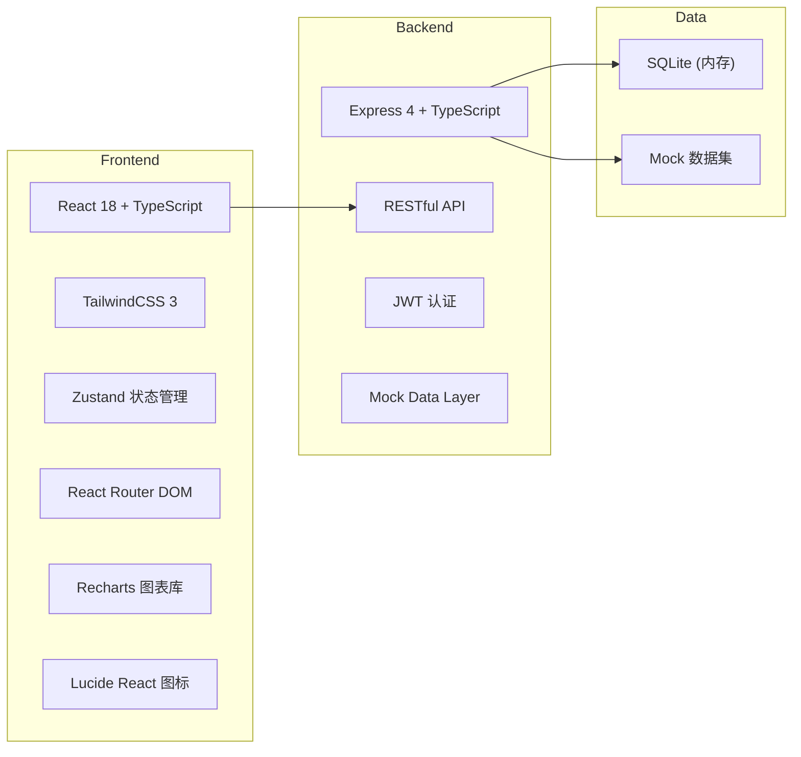
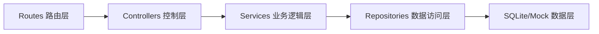
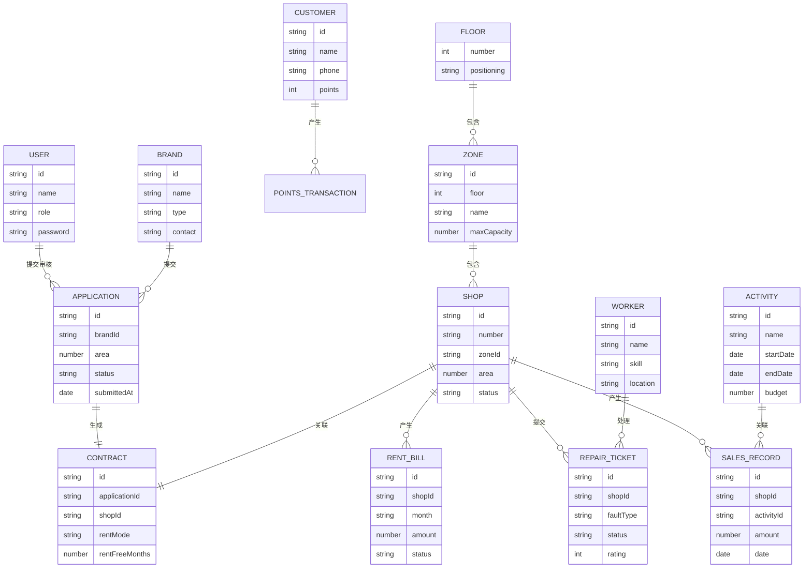

# 大型商业综合体全场景运营管理平台 技术架构

## 1. 架构设计



## 2. 技术描述

- **前端**：React@18 + TypeScript + TailwindCSS@3 + Vite
- **初始化工具**：vite-init (react-express-ts 模板)
- **后端**：Express@4 + TypeScript
- **数据库**：SQLite 内存数据库 + 丰富Mock数据
- **图表**：Recharts
- **状态管理**：Zustand
- **路由**：React Router DOM v6
- **图标**：Lucide React

## 3. 路由定义

| 路由 | 页面 | 权限角色 |
|-------|------|----------|
| /login | 登录页 | 公开 |
| /dashboard | 首页仪表盘 | 所有登录用户 |
| /merchants/applications | 入驻申请列表 | 招商部 |
| /merchants/recommendations | 铺位智能推荐 | 招商部 |
| /merchants/contracts | 电子合同管理 | 招商部 |
| /operations/activities | 促销活动列表 | 运营部 |
| /operations/sales | 销售统计排行 | 运营部 |
| /finance/bills | 租金账单列表 | 财务部 |
| /finance/overdue | 逾期管理 | 财务部 |
| /property/tickets | 报修工单 | 物业部 |
| /property/dispatch | 智能派单 | 物业部 |
| /executive/heatmap | 热力图分析 | 总经理 |
| /executive/adjustment | 租金调整 | 总经理 |
| /system/passenger | 客流监控 | 所有登录用户 |
| /system/points | 积分商城 | 所有登录用户 |
| /system/reports | 运营报告 | 总经理 |
| /system/messages | 消息中心 | 所有登录用户 |

## 4. API 定义

### 4.1 认证接口
```typescript
interface LoginRequest {
  role: 'merchant' | 'operations' | 'finance' | 'property' | 'executive';
  username: string;
  password: string;
}

interface LoginResponse {
  token: string;
  user: {
    id: string;
    name: string;
    role: string;
    avatar: string;
  };
}
```

### 4.2 招商管理接口
```typescript
// GET /api/applications
interface Application {
  id: string;
  brandName: string;
  brandType: string;
  contactName: string;
  contactPhone: string;
  area: number;
  status: 'pending' | 'approved' | 'rejected';
  submittedAt: string;
}

// POST /api/applications/:id/approve
// GET /api/recommendations/:applicationId
interface Recommendation {
  floor: number;
  zone: string;
  shopNumber: string;
  area: number;
  score: number;
  reason: string;
}

// GET /api/contracts/:applicationId
interface Contract {
  id: string;
  brandName: string;
  shopNumber: string;
  rentFreeMonths: number;
  rentMode: 'fixed' | 'percentage' | 'mixed';
  rentAmount: number;
  percentageRate: number;
  contractTerm: number;
  startDate: string;
  endDate: string;
}
```

### 4.3 运营管理接口
```typescript
// GET /api/activities
interface Activity {
  id: string;
  name: string;
  type: string;
  startDate: string;
  endDate: string;
  budget: number;
  recommendedBudget: number;
  status: 'draft' | 'active' | 'completed';
  participants: string[];
  recommendedBrands: string[];
}

// GET /api/sales/ranking
interface SalesRank {
  shopId: string;
  shopName: string;
  baselineSales: number;
  activitySales: number;
  increment: number;
  incrementRate: number;
}
```

### 4.4 财务管理接口
```typescript
// GET /api/bills
interface RentBill {
  id: string;
  shopId: string;
  shopName: string;
  month: string;
  rentType: 'fixed' | 'percentage';
  baseRent: number;
  salesAmount: number;
  percentageRent: number;
  totalAmount: number;
  dueDate: string;
  paidAt: string | null;
  overdueDays: number;
  lateFee: number;
  status: 'unpaid' | 'paid' | 'overdue' | 'locked';
}

// POST /api/bills/:id/pay
// POST /api/bills/:id/lock
// POST /api/bills/:id/unlock
```

### 4.5 物业管理接口
```typescript
// GET /api/tickets
interface RepairTicket {
  id: string;
  shopId: string;
  shopName: string;
  faultType: string;
  description: string;
  priority: 'low' | 'medium' | 'high' | 'urgent';
  status: 'pending' | 'assigned' | 'in_progress' | 'completed' | 'rated';
  workerId: string | null;
  workerName: string | null;
  rating: number | null;
  createdAt: string;
  completedAt: string | null;
}

// POST /api/tickets/:id/dispatch
// POST /api/tickets/:id/complete
// POST /api/tickets/:id/rate
```

### 4.6 总经理视图接口
```typescript
// GET /api/executive/metrics
interface ExecutiveMetrics {
  floorEfficiency: { floor: number; efficiency: number }[];
  conversionRate: { floor: number; rate: number }[];
  churnRate: { floor: number; rate: number }[];
}

// GET /api/passenger/density
interface PassengerDensity {
  zoneId: string;
  zoneName: string;
  floor: number;
  currentCount: number;
  maxCapacity: number;
  density: number;
  status: 'normal' | 'warning' | 'danger';
}

// POST /api/rent/adjustment
interface RentAdjustment {
  floor: number;
  zone: string;
  coefficient: number;
  effectiveDate: string;
}
```

### 4.7 积分系统接口
```typescript
// GET /api/points/balance
interface PointsBalance {
  customerId: string;
  totalPoints: number;
  availablePoints: number;
}

// GET /api/points/gifts
interface Gift {
  id: string;
  name: string;
  pointsRequired: number;
  stock: number;
  image: string;
}

// POST /api/points/redeem
// POST /api/points/parking
```

## 5. 后端分层架构



## 6. 数据模型

### 6.1 ER图



### 6.2 DDL 语句

```sql
-- 用户表
CREATE TABLE users (
  id TEXT PRIMARY KEY,
  name TEXT NOT NULL,
  role TEXT NOT NULL CHECK (role IN ('merchant', 'operations', 'finance', 'property', 'executive')),
  username TEXT UNIQUE NOT NULL,
  password TEXT NOT NULL,
  avatar TEXT,
  created_at TEXT DEFAULT CURRENT_TIMESTAMP
);

-- 品牌表
CREATE TABLE brands (
  id TEXT PRIMARY KEY,
  name TEXT NOT NULL,
  type TEXT NOT NULL,
  contact_name TEXT NOT NULL,
  contact_phone TEXT NOT NULL,
  description TEXT,
  logo TEXT,
  created_at TEXT DEFAULT CURRENT_TIMESTAMP
);

-- 楼层表
CREATE TABLE floors (
  number INTEGER PRIMARY KEY,
  name TEXT NOT NULL,
  positioning TEXT NOT NULL,
  total_area REAL NOT NULL
);

-- 区域表
CREATE TABLE zones (
  id TEXT PRIMARY KEY,
  floor_number INTEGER NOT NULL REFERENCES floors(number),
  name TEXT NOT NULL,
  max_capacity INTEGER NOT NULL,
  created_at TEXT DEFAULT CURRENT_TIMESTAMP
);

-- 铺位表
CREATE TABLE shops (
  id TEXT PRIMARY KEY,
  shop_number TEXT NOT NULL,
  zone_id TEXT NOT NULL REFERENCES zones(id),
  area REAL NOT NULL,
  status TEXT NOT NULL DEFAULT 'vacant' CHECK (status IN ('vacant', 'occupied', 'under_renovation')),
  brand_id TEXT REFERENCES brands(id),
  created_at TEXT DEFAULT CURRENT_TIMESTAMP
);

-- 入驻申请表
CREATE TABLE applications (
  id TEXT PRIMARY KEY,
  brand_id TEXT NOT NULL REFERENCES brands(id),
  required_area REAL NOT NULL,
  preferred_floor INTEGER,
  status TEXT NOT NULL DEFAULT 'pending' CHECK (status IN ('pending', 'reviewing', 'approved', 'rejected')),
  reviewer_id TEXT REFERENCES users(id),
  review_note TEXT,
  reviewed_at TEXT,
  submitted_at TEXT DEFAULT CURRENT_TIMESTAMP
);

-- 合同表
CREATE TABLE contracts (
  id TEXT PRIMARY KEY,
  application_id TEXT NOT NULL REFERENCES applications(id),
  shop_id TEXT NOT NULL REFERENCES shops(id),
  rent_mode TEXT NOT NULL CHECK (rent_mode IN ('fixed', 'percentage', 'mixed')),
  rent_free_months INTEGER NOT NULL DEFAULT 0,
  fixed_rent_amount REAL,
  percentage_rate REAL,
  contract_term_months INTEGER NOT NULL,
  start_date TEXT NOT NULL,
  end_date TEXT NOT NULL,
  signed_at TEXT,
  status TEXT NOT NULL DEFAULT 'draft' CHECK (status IN ('draft', 'signed', 'terminated')),
  created_at TEXT DEFAULT CURRENT_TIMESTAMP
);

-- 促销活动表
CREATE TABLE activities (
  id TEXT PRIMARY KEY,
  name TEXT NOT NULL,
  type TEXT NOT NULL,
  start_date TEXT NOT NULL,
  end_date TEXT NOT NULL,
  recommended_budget REAL NOT NULL,
  actual_budget REAL,
  status TEXT NOT NULL DEFAULT 'draft' CHECK (status IN ('draft', 'approved', 'active', 'completed')),
  creator_id TEXT NOT NULL REFERENCES users(id),
  created_at TEXT DEFAULT CURRENT_TIMESTAMP
);

-- 活动参与品牌
CREATE TABLE activity_participants (
  id TEXT PRIMARY KEY,
  activity_id TEXT NOT NULL REFERENCES activities(id),
  shop_id TEXT NOT NULL REFERENCES shops(id),
  is_recommended INTEGER NOT NULL DEFAULT 0,
  joined_at TEXT,
  created_at TEXT DEFAULT CURRENT_TIMESTAMP
);

-- 销售记录表
CREATE TABLE sales_records (
  id TEXT PRIMARY KEY,
  shop_id TEXT NOT NULL REFERENCES shops(id),
  activity_id TEXT REFERENCES activities(id),
  amount REAL NOT NULL,
  transaction_date TEXT NOT NULL,
  customer_id TEXT,
  points_earned INTEGER DEFAULT 0,
  created_at TEXT DEFAULT CURRENT_TIMESTAMP
);

-- 租金账单表
CREATE TABLE rent_bills (
  id TEXT PRIMARY KEY,
  shop_id TEXT NOT NULL REFERENCES shops(id),
  bill_month TEXT NOT NULL,
  rent_type TEXT NOT NULL CHECK (rent_type IN ('fixed', 'percentage')),
  base_rent REAL NOT NULL,
  sales_amount REAL,
  percentage_rent REAL,
  total_amount REAL NOT NULL,
  due_date TEXT NOT NULL,
  paid_at TEXT,
  overdue_days INTEGER DEFAULT 0,
  late_fee REAL DEFAULT 0,
  status TEXT NOT NULL DEFAULT 'unpaid' CHECK (status IN ('unpaid', 'paid', 'overdue', 'locked')),
  access_locked INTEGER DEFAULT 0,
  created_at TEXT DEFAULT CURRENT_TIMESTAMP
);

-- 维修工单表
CREATE TABLE repair_tickets (
  id TEXT PRIMARY KEY,
  shop_id TEXT NOT NULL REFERENCES shops(id),
  fault_type TEXT NOT NULL,
  description TEXT NOT NULL,
  priority TEXT NOT NULL CHECK (priority IN ('low', 'medium', 'high', 'urgent')),
  status TEXT NOT NULL DEFAULT 'pending' CHECK (status IN ('pending', 'assigned', 'in_progress', 'completed', 'rated')),
  worker_id TEXT REFERENCES workers(id),
  rating INTEGER,
  review_comment TEXT,
  created_at TEXT DEFAULT CURRENT_TIMESTAMP,
  assigned_at TEXT,
  completed_at TEXT,
  rated_at TEXT
);

-- 维修工人表
CREATE TABLE workers (
  id TEXT PRIMARY KEY,
  name TEXT NOT NULL,
  skill TEXT NOT NULL,
  phone TEXT NOT NULL,
  current_zone TEXT REFERENCES zones(id),
  status TEXT NOT NULL DEFAULT 'available' CHECK (status IN ('available', 'busy', 'offline')),
  created_at TEXT DEFAULT CURRENT_TIMESTAMP
);

-- 客户表
CREATE TABLE customers (
  id TEXT PRIMARY KEY,
  name TEXT,
  phone TEXT UNIQUE,
  total_points INTEGER NOT NULL DEFAULT 0,
  available_points INTEGER NOT NULL DEFAULT 0,
  created_at TEXT DEFAULT CURRENT_TIMESTAMP
);

-- 积分交易表
CREATE TABLE points_transactions (
  id TEXT PRIMARY KEY,
  customer_id TEXT NOT NULL REFERENCES customers(id),
  type TEXT NOT NULL CHECK (type IN ('earn', 'redeem', 'parking')),
  amount INTEGER NOT NULL,
  reference TEXT,
  created_at TEXT DEFAULT CURRENT_TIMESTAMP
);

-- 礼品表
CREATE TABLE gifts (
  id TEXT PRIMARY KEY,
  name TEXT NOT NULL,
  points_required INTEGER NOT NULL,
  stock INTEGER NOT NULL DEFAULT 0,
  image TEXT,
  description TEXT,
  created_at TEXT DEFAULT CURRENT_TIMESTAMP
);

-- 消息表
CREATE TABLE messages (
  id TEXT PRIMARY KEY,
  recipient_id TEXT NOT NULL REFERENCES users(id),
  type TEXT NOT NULL,
  title TEXT NOT NULL,
  content TEXT NOT NULL,
  related_id TEXT,
  is_read INTEGER NOT NULL DEFAULT 0,
  created_at TEXT DEFAULT CURRENT_TIMESTAMP
);

-- 客流记录表
CREATE TABLE passenger_logs (
  id TEXT PRIMARY KEY,
  zone_id TEXT NOT NULL REFERENCES zones(id),
  count INTEGER NOT NULL,
  record_time TEXT NOT NULL,
  created_at TEXT DEFAULT CURRENT_TIMESTAMP
);

-- 运营报告表
CREATE TABLE reports (
  id TEXT PRIMARY KEY,
  report_month TEXT NOT NULL,
  rent_collection_rate REAL,
  total_passenger INTEGER,
  activity_roi REAL,
  content TEXT,
  pushed INTEGER DEFAULT 0,
  created_at TEXT DEFAULT CURRENT_TIMESTAMP
);
```
